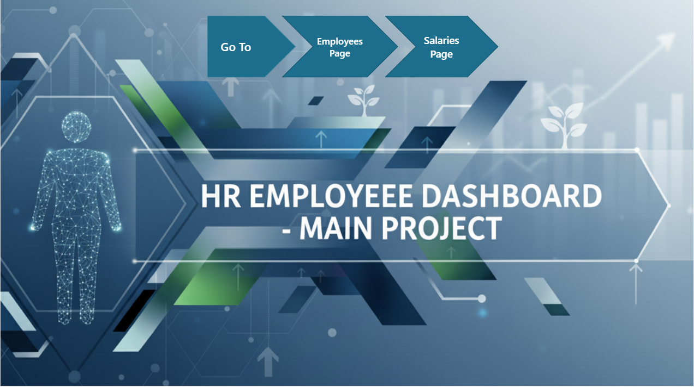
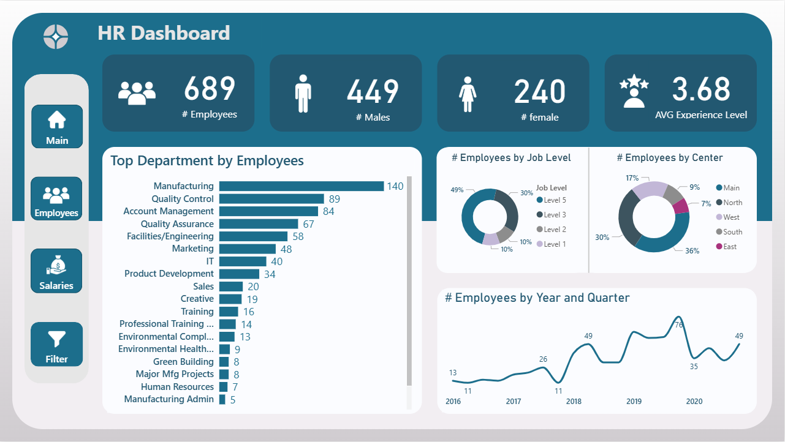
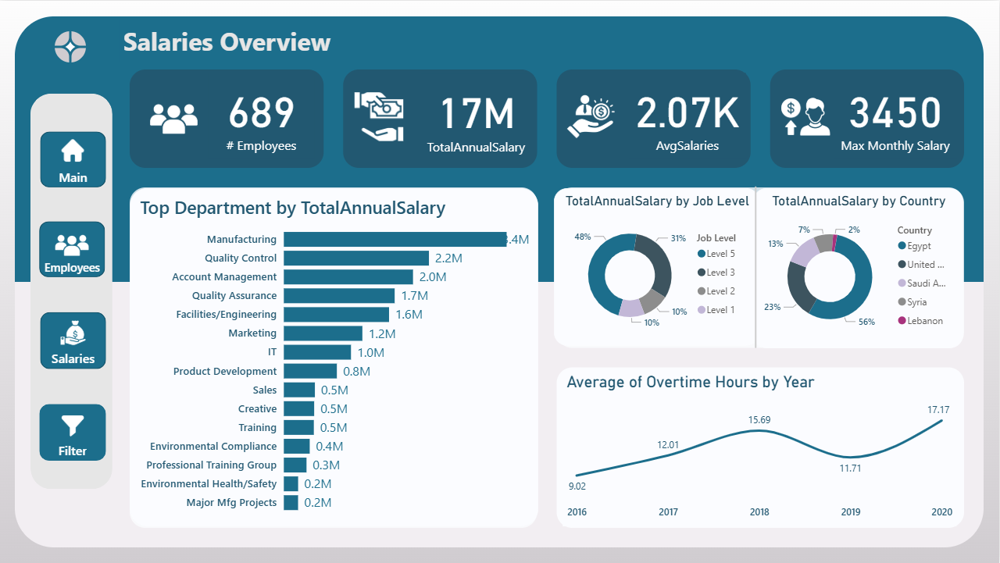

# HR-Analytics-Dashoard
HR Analytics project using Power BI focusing on salary and workforce insights

## Project Highlights:
### 📊 Multi-dimensional Analytics
- Real-time tracking of 689 employees across multiple departments and locations
- Comprehensive salary analysis totaling 17M annually
- Workforce distribution across 5 job levels and multiple centers

### 💡 Key Features:

- Interactive department performance metrics
- Overtime trend analysis spanning 2016-2020
- Gender diversity tracking and job level distribution
- Geographic workforce distribution across multiple countries
- Dynamic filtering capabilities for deeper insights

## Impact:
This dashboard empowers HR teams and leadership to make data-driven decisions about compensation, workforce planning, and resource allocation. The visualization transforms complex HR data into clear, actionable intelligence.

## 📧 Contact
Mohamed Hesham - mohishamwork@gmail.com
